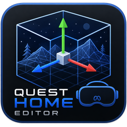

<p align="center">
  
</p>

# Quest Home Editor — port old Meta Quest homes to today's Quest

Load an **old (V79-era) Meta Quest home**, walk around it, edit it like a tiny Blender, then
**cook** it into a modern HSL environment APK — **signed and installed onto your Quest 2 / 3 / Pro
in one click**. One binary does all of it: a faithful Vulkan replica of Meta's `libshell` renderer,
a full scene editor, and the V79→V205 cooker.

> 🧪 **Research project, shared as-is.** It's reverse-engineered from `libshell.so` and under heavy
> active development — expect the occasional rough edge. That said, the pipeline is solid: whole
> official V79 homes (geometry, textures, lightmaps, materials, node + skeletal + UV animation,
> audio, chairs/navmesh/spawns) cook into installable APKs today.

**📖 Start here → [the Wiki](../../wiki)** — install guide, cook walkthrough, troubleshooting, and
deep-dive internals.

---

## Download

Grab a build from **[Releases](../../releases)**:

| File | For |
| --- | --- |
| `Quest-Home-Editor-windows-x64.exe` | Windows, 64-bit (Vulkan GPU) |
| `Quest-Home-Editor-linux-x64` / `.AppImage` | Linux (CI — once Actions is live) |
| `Quest-Home-Editor-macos-arm64.dmg` / `-x64.dmg` | macOS, MoltenVK bundled (CI — once Actions is live) |

A GPU with **Vulkan** support is required on every OS (macOS via MoltenVK, which the `.dmg` bundles).

## Quick start (port a home in 2 minutes)

1. Drop **`adb.exe` + `AdbWinApi.dll` + `AdbWinUsbApi.dll`** next to the exe
   (Linux/macOS: just `adb`). Headset in **Developer Mode**, USB-debugging accepted.
2. **Drag the old home** (`env.apk` / `.gltf.ovrscene` / `.opa`) onto the window.
3. Open the **Cook** tab → **`COOK + SIGN + INSTALL`**.
4. Put the headset on. Done — on a non-rooted Quest the port loads **in place of Haven 2025**
   (the original is backed up first; `--restore-haven` puts it back anytime).

> ⚠️ **Give the home something to stand on.** A port needs **at least one collider** or the player
> falls through the floor forever. Easiest: leave **Auto floor collision** on (Cook tab, default).
> Otherwise place a **Navmesh** or **Box collider** (Scene tab → **+ Add**). If a cook would ship
> **zero** collision, the editor warns you before it starts.

Full walkthrough: **[Installation & Setup](../../wiki/Installation-and-Setup)** →
**[Cooking a Home](../../wiki/Cooking-a-Home)**.

## My port fell back to Haven / nuxd — report it (no root needed)

If a cooked home doesn't show up (the headset stays on Haven 2025 / the default), the shell
**rejected** it and fell back. The **Logcat** tab tells you *exactly why* — and it works on an
**unrooted** Quest (tethered `adb` only; no `su`, no Magisk):

1. Connect the Quest by USB (or wireless `adb`) — Developer Mode on, USB-debugging accepted.
2. Open the **`Logcat`** tab. It **auto-starts** at full verbosity (`debug.logLevel Verbose`,
   set with no root) and streams `com.oculus.vrshell`'s log live.
3. Click **`Reload home`** — that clears the log and restarts the shell so you capture the *fresh*
   env load. Watch the highlighted (cyan) `EnvironmentSystem` lines:
   - `Scene loaded: apk://…` → it loaded fine.
   - `Environment failed to load … falling back to device default …` → it was **rejected**, and the
     line just above it is the reason (`Asset ptr error … reason: …`, `Failed to find '…' in zip`,
     `LoadEntry not found`, `package type not supported`, `MeshDefinition::fix …`, …).
4. Click **`Export`** → it writes a self-contained report (device model/OS, selected env, the load
   log, and a one-line verdict) and reveals it. **Attach that file** when you report the issue on
   [Discord / Issues](#community) — it pinpoints the cause.

`Filter` cycles the view **Env-load ↔ vrshell ↔ EVERYTHING**; the tool column can be **dragged wider
(up to 75%)** and **docked left or right** by dragging the grip on the tab strip (Photoshop-style).

## What it does

**Porting (the point of it all)**
- **V79 → V205/HSL cook**: `RENDMESH` / `MATL` / `RENDTXTR` (lossless ASTC pass-through where
  possible, sRGB-tagged) / `HSTF` / `HZAN` + `scene.zip`, spliced into a signed, installable APK.
- **Animations port for real** — node spin/sway/translate/scale, UV scrolls, spritesheet flipbooks
  (exact per-frame matrix replay + cell clamping), material tint/fade cycles, **skeletal HZANIM**
  skinned meshes (ACL-compressed, large meshes auto-split), VAT vertex animation. Full-length
  clips, no frame caps, no joint pruning.
- **Materials 1:1** — authored blend/additive/cutout with per-material `alphatestthreshold`,
  SpecIbl lighting baked from the env's own IBL cubemaps, baked lightmaps, per-material generated
  SPIR-V shaders bound by `MurmurHash3(matParams.name)` — decoded from `libshell` itself, not guessed.
- **Audio** — the env's background loop (incl. Ogg-Opus) converts to an auto-starting FMOD bank.
- **Root-aware auto-install** — rooted headsets get the env under its own package (auto-selected);
  non-rooted get a **Haven 2025 spoof** (with automatic backup + one-click restore).
  See [The Two APKs](../../wiki/The-Two-APKs).

**Editor**
- Blender-style: outliner with visibility eyes, click-select, move/rotate/scale gizmos, undo/redo,
  X-ray, multi-select, knife tool, prefabs (drag-drop spawn), mesh slicing and hole sealing.
- **Meta components you can place**: spawn points, chairs (sittable, haven-exact), box/mesh
  colliders, walkable **navmesh** (baked from selection), wall placements (with a facing arrow +
  one-click flip), locomotion hotspots, kill-floor boundary.
- Material & texture tools: live tint/brightness/saturation/hue baking, de-shadowing, procedural
  textures, texture export, **shader decompile → edit GLSL → hot-reload live**.
- Dome/skybox tools, far-clip escape for huge vistas, walk-simulation mode with real collision.
- **Blender round-trip**: export the env as glTF 2.0, edit it in Blender, re-import.
- Timeline with scrub/pause that can **mirror to the headset live** (bridge).
- **Drive the headset player from the desktop**: a live player gizmo you drag to teleport/rotate the player
  on the Quest, with a **no-gravity** toggle (float up to inspect anything without falling) — via the
  companion patcher below. **Install-only** re-installs an unchanged cook without re-cooking.
- Sessions persist to `saved/<env>.hsledit`; cooks land in `cooked/`.

**Companion device patcher** — [**vrshell-aio-patcher**](https://github.com/xAstroBoy/vrshell-aio-patcher)
patches your Quest's VrShell (far-clip escape, moonjump/fly, no-gravity, live player teleport/rotate, an
on-device control bridge) so the editor's live controls and headset mirror work. Source only; you build it
against your own headset's VrShell.

**Renderer (a faithful preview replica)**
- Vulkan replica of `libshell`'s HSR pipeline: per-material `MeshShellEnv`, reversed-Z,
  authored blend state, IBL, lightmaps, fog. It is a **close preview, not the final word** — the
  **Quest's own `libshell` is the real renderer**; some things only appear correctly on the headset,
  so **always verify a cook on-device**.

## Building from source

Vendored deps (Vulkan headers, volk, miniz, miniaudio, stb, ACL/RTM) are in-tree; CMake fetches
GLFW, astc-encoder and Opus. No Vulkan SDK needed (volk loads at runtime). PhysX is off by default.

```bash
# Windows (MSVC + Ninja)         # from QuestHomeEditor/
build_hsr.bat

# Linux
sudo apt-get install -y cmake ninja-build libvulkan-dev \
  libx11-dev libxrandr-dev libxinerama-dev libxcursor-dev libxi-dev libwayland-dev libxkbcommon-dev
cmake -S QuestHomeEditor -B build -G Ninja -DCMAKE_BUILD_TYPE=Release
cmake --build build --target questhomeeditor

# macOS (MoltenVK)
brew install molten-vk ninja
cmake -S QuestHomeEditor -B build -G Ninja -DCMAKE_BUILD_TYPE=Release
cmake --build build --target questhomeeditor
```

- Texture encoding defaults to **SSE4.1** (runs anywhere); add `-DHSR_AVX2=ON` on a 2013+ CPU for
  ~1.3× faster cooks.
- Keep `third_party/fonts/` reachable from the binary (the packaged builds bundle it as `fonts/`);
  the UI also falls back to your OS system fonts.
- CI (`.github/workflows/build.yml`) builds all platforms and attaches artifacts to `v*` tag releases.

## Sign a shared APK (no re-cook)

`INSTALL_PARSE_FAILED_NO_CERTIFICATES` = unsigned. Fix:

```
"Quest Home Editor.exe" --sign home.apk      # -> home_signed.apk
"Quest Home Editor.exe" --fetch-tools        # pre-fetch build-tools + JRE beside the exe (zero-SDK machines)
```

## Layout

| Path | What |
| --- | --- |
| `QuestHomeEditor/src/` | Renderer + editor + cooker (C++17, mostly headers) |
| `QuestHomeEditor/tools/` | Shader decompile/recompile helpers (spirv-cross, glslang) |
| `QuestHomeEditor/third_party/` | Vendored deps (volk, Vulkan headers, miniz, stb, ACL/RTM, fonts) |
| `.github/workflows/build.yml` | 3-OS CI → prebuilt binaries |

## Community

- **[Wiki](../../wiki)** — user guide + internals.
- **[Issues](../../issues)** — bugs & requests welcome; crash reports: attach `_crash.txt`
  (written next to the exe on every crash, all platforms).

## License

Research / educational use. All Meta content (environments, `libshell`, Haven 2025) belongs to Meta;
this project ships none of it — it only converts files you already have.
